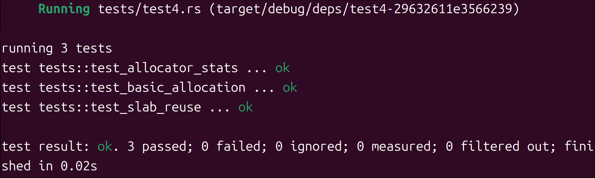
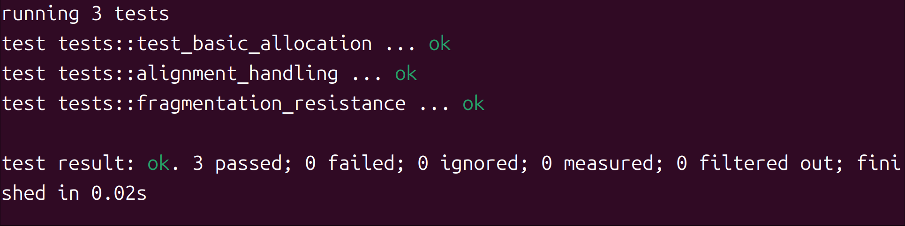
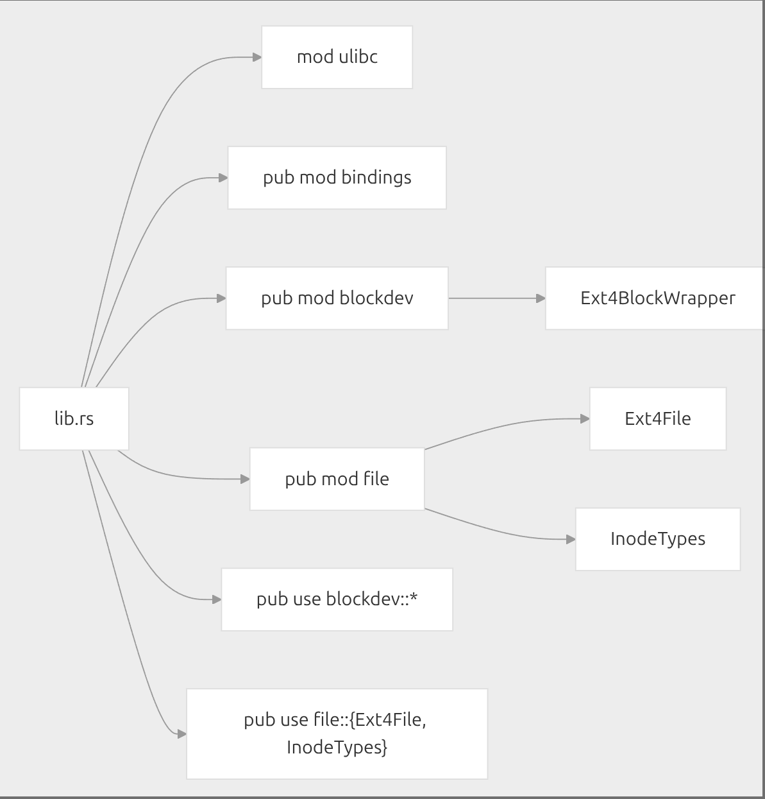
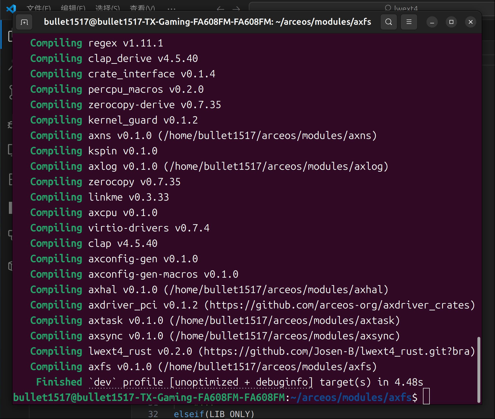
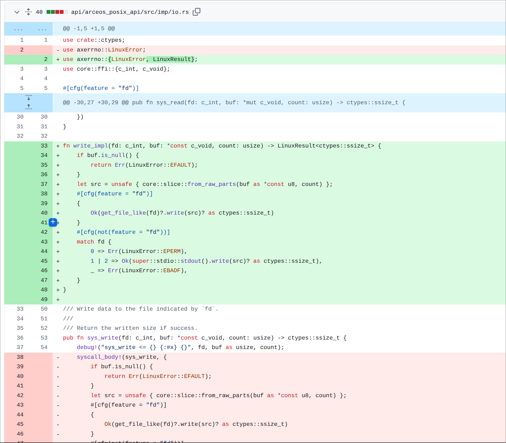

# arceos-stage4-blog
## 序言
首先，非常高兴能够进入开源操作系统训练营第四阶段的学习，和诸多优秀的同学交流技术，让我对操作系统诸多底层细节实现有了更深刻的理解，在动手实践的过程中，也和老师们交流了许多，感谢陈渝老师在周会中给予的指引，也感谢郑友捷老师在宏内核项目上的许多解答，也感谢郑植陈宏同学在合并下游仓库过程中的指点交流，诸多种种令我受益匪浅。

## 具体工作
本次阶段四总共四周，以下按照时间线陈述我的工作内容

### 第一周
由于我完成二三阶段的时间比较晚了，几乎是踩着ddl加入的第四阶段，加上在和陈老师的讨论中我表达了自己想更熟悉操作系统底层的一些具体实现，第一周陈老师给我安排的任务是给allocator模块编写说明文档，在这个过程中一方面锻炼我对代码工程的阅读能力，也一方面希望这样一份工作能为后来者提供便利，更好地了解arceos这样一个组件化操作系统。

在第一周主要还是以阅读代码为主，并基于deepwiki给出的指引写了一份简短的项目结构简介

### 第二周
在第一周的周会结束后，和老师交流之后我就开始思考，以一个刚入门的初学者，怎样的文档才能让我更直观地学习一个项目模块呢？我选择从两方面入手，一方面以开发者的视角直观地展示allocator这个模块的功能实现过程;另一方面我以一个使用者的视角给出一个具体使用的代码展示，以测试的方式展示算法的特性，下面以其中的buddy分配算法为例简单介绍：

由于算法本身特性：将内存划分为大小为 2^n 的块，分配时，系统查找最小能满足请求的块；如果块过大，则递归分裂为两个大小相等的“伙伴”块。释放时，系统检查相邻伙伴块是否空闲，若空闲则合并为更大的块，由此在编写文档和测例时，着重展现大块分裂与合并的过程：

以下是一个简单的使用示例以及结果输出
```rust
// test3.rs
extern crate alloc;

use alloc::boxed::Box;
use allocator::BuddyByteAllocator;
use core::alloc::Layout;
use allocator::ByteAllocator;
use allocator::BaseAllocator;

// 创建堆内存池（避免栈溢出）
fn create_test_pool(size: usize) -> Box<[u8]> {
    vec![0u8; size].into_boxed_slice()
}

#[cfg(test)]
mod tests {
    use super::*;

    #[test]
    fn fragmentation_handling() {
        const HEAP_SIZE: usize = 4 * 1024 * 1024; // 4MB
        let heap_mem = create_test_pool(HEAP_SIZE);
        let heap_start = heap_mem.as_ptr() as usize;
        let mut allocator = BuddyByteAllocator::new();
        
        unsafe {
            allocator.init(heap_start, heap_mem.len());
        }

        // 分配多个小块（制造碎片）
        let mut ptrs = Vec::new();
        let small_layout = Layout::from_size_align(4096, 4096).unwrap(); // 4KB
        
        for _ in 0..100 {
            let ptr = allocator.alloc(small_layout).expect("小块分配失败");
            ptrs.push(ptr);
        }
        
        // 释放所有奇数索引的块
        for i in (1..ptrs.len()).step_by(2) {
            allocator.dealloc(ptrs[i], small_layout);
        }
        
        // 尝试分配大块（应能利用碎片合并）
        let large_size = 1024 * 1024; // 1MB
        let large_layout = Layout::from_size_align(large_size, large_size).unwrap();
        assert!(
            allocator.alloc(large_layout).is_ok(),
            "应能利用碎片分配{}字节大块",
            large_size
        );
        
        // 清理剩余内存
        for i in (0..ptrs.len()).step_by(2) {
            allocator.dealloc(ptrs[i], small_layout);
        }
    }
}
```

类似地，针对bitmap、slab、tlsf算法也编写了对应算法特性的测例,详情可见https://github.com/numpy1314/allocator/tree/main/doc   
在文档中详细讲解了算法的具体实现过程，

针对页级别的分配算法bitmap分别写了单页分配和多页分配的测试；

针对slab算法可以快速重用的特性编写了分配再释放奇数索引而后再分配的测试（比较遗憾的是这个只是展示，实际的性能表现没有进行测试）；


针对tlsf算法优化碎片管理的特性，循环一百次分配不同大小的内存块，然后释放特定条件的块，主动创造大量小块空闲空间，再尝试能否成功分配超出单个空闲块尺寸的大内存请求


### 第三、四周
第三、四周的工作主要是和郑植陈宏同学一起完成arceos的下游仓库合并工作，主要是将arceos的下游仓库中的代码合并到arceos主仓库中，这一过程中由于我对git的使用不够熟练，遇到了不少问题，感谢郑植陈宏同学的耐心指导和帮助，也感谢柏乔森工程师在过程中的指导，让我对lwext4文件系统的简单实现有了一个初步的了解,下面是简单的介绍。

文件系统是一个相对庞大的工程，因此本次简单的支持lwext4文件系统的读写功能的pr还是基于已有的lwext4的c库对其进行封装利用，lwext4-rust链接https://github.com/Josen-B/lwext4_rust



其中binding.rs是由bindgen工具自动生成的C语言绑定文件，包含了从C头文件转换来的Rust函数声明、结构体定义和常量

blockdev.rs是块设备操作实现部分，其中定义了操作系统需要实现的磁盘操作接口；KernelDevOp trait，实现了与具体操作系统的解耦；定义了Ext4BlockWrapper结构体，封装了ext4块设备的所有操作，包括挂载、卸载、读写等功能；也实现了供C调用的回调函数，如设备打开、读取、写入

file.rs是文件操作接口的具体实现，包含Ext4File结构体，提供文件的创建、读写、定位等操作。与块设备操作解耦，专注于文件级别的操作

而后就是在arceos上对ext4的核心支持https://github.com/numpy1314/arceos/blob/test/modules/axfs/src/fs/ext4fs.rs

首先对文件系统进行初始化，接收磁盘设备作为输入，初始化 EXT4 文件系统包装器（Ext4BlockWrapper），创建根目录节点（FileWrapper类型），最后返回完整的文件系统实例
```rust
impl Ext4FileSystem {
    #[cfg(feature = "use-ramdisk")]
    pub fn new(mut disk: Disk) -> Self {
        unimplemented!()
    }

    #[cfg(not(feature = "use-ramdisk"))]
    pub fn new(disk: Disk) -> Self {
        info!("获取磁盘信息 大小: {}, 位置: {}", disk.size(), disk.position());
        // 初始化 EXT4 文件系统包装器
        let inner = Ext4BlockWrapper::<Disk>::new(disk).expect("初始化 EXT4 文件系统失败");
        // 创建根目录节点
        let root = Arc::new(FileWrapper::new("/", InodeTypes::EXT4_DE_DIR));
        Self { inner, root }
    }
}
```
涉及路径处理的部分
```rust
/// 路径规范化处理逻辑
/// 用于处理相对路径，将其转换为绝对路径。它会处理多余的斜杠、当前目录（.）等，并相对于当前节点的路径构建完整路径
fn path_deal_with(&self, path: &str) -> String {
    let trim_path = path.trim_matches('/');
    if trim_path.is_empty() || trim_path == "." {
        return String::new();
    }

    let mut result = if let Some(rest) = trim_path.strip_prefix("./") {
        rest
    } else {
        trim_path
    }
    .replace("//", "/");

    if trim_path != result {
        return self.path_deal_with(&result);
    }

    let file = self.0.lock();
    let base_path = file.get_path().to_str().unwrap().trim_end_matches('/');
    let fpath = format!("{}/{}", base_path, trim_path);
    debug!("生成完整路径: {}", fpath);
    fpath
}
```
​​文件操作​​:

- get_attr：获取文件属性（权限、类型、大小等）。如果是文件，它会打开文件获取大小，然后关闭。
- create：创建文件或目录。根据传入的节点类型创建相应的 inode。
- remove：删除文件或目录（如果是目录则调用 dir_rm，文件则调用 file_remove）。
- parent：获取父目录的节点引用。通过解析当前路径获取父目录路径，然后创建一个新的 FileWrapper 节点。
- read_dir：读取目录内容，将目录项填充到 dirents 数组中，返回实际读取的条目数。
- lookup：查找给定路径的节点，可以是文件或目录。
- read_at 和 write_at：在指定位置读写文件内容
- truncate：截断文件到指定大小。
- rename：重命名文件或目录。

这部分内容较长，具体实现在ext4fs.rs中90-289行

​​磁盘操作​​:

- 由于Disk 类型实现了 KernelDevOp trait，因此提供了块设备的基本操作（读、写、刷新、定位）。
- read 和 write 方法通过循环调用设备的 read_one 和 write_one 方法，确保读取或写入整个缓冲区。
- seek 方法根据 whence 参数（SEEK_SET、SEEK_CUR、SEEK_END）计算新的位置。
```rust
impl KernelDevOp for Disk {
    type DevType = Disk;

    fn read(dev: &mut Disk, mut buf: &mut [u8]) -> Result<usize, i32> {
        trace!("READ block device buf={}", buf.len());
        let mut read_len = 0;
        while !buf.is_empty() {
            match dev.read_one(buf) {
                Ok(0) => break,
                Ok(n) => {
                    buf = &mut buf[n..];
                    read_len += n;
                }
                Err(_) => return Err(DevError::Io as i32),
            }
        }
        trace!("READ rt len={}", read_len);
        Ok(read_len)
    }

    fn write(dev: &mut Self::DevType, mut buf: &[u8]) -> Result<usize, i32> {
        trace!("WRITE block device buf={}", buf.len());
        let mut write_len = 0;
        while !buf.is_empty() {
            match dev.write_one(buf) {
                Ok(0) => break,
                Ok(n) => {
                    buf = &buf[n..];
                    write_len += n;
                }
                Err(_) => return Err(DevError::Io as i32),
            }
        }
        trace!("WRITE rt len={}", write_len);
        Ok(write_len)
    }

    fn flush(_dev: &mut Self::DevType) -> Result<usize, i32> {
        debug!("uncomplicated");
        Ok(0)
    }

    fn seek(dev: &mut Disk, off: i64, whence: i32) -> Result<i64, i32> {
        let size = dev.size();
        let pos = dev.position();
        trace!(
            "SEEK block device size:{}, pos:{}, offset={}, whence={}",
            size, pos, off, whence
        );

        let new_pos = match whence as u32 {
            SEEK_SET => off,
            SEEK_CUR => pos as i64 + off,
            SEEK_END => size as i64 + off,
            _ => {
                error!("invalid seek() whence: {}", whence);
                return Err(DevError::Io as i32);
            }
        };

        if new_pos < 0 {
            warn!("Negative seek position");
            return Err(DevError::Io as i32);
        }

        if new_pos as u64 > size {
            warn!("Seek position is beyond device size");
        }
        dev.seek_position(new_pos as u64);
        Ok(new_pos)
    }
}
```
目前整个文件系统还有很多需要修改的地方待完成,包括读写性能不够理想，但基本的文件系统功能已能支持,这里附一张构建成功的截图


除此之外还有一个文件系统相关的pr已合并 https://github.com/arceos-org/arceos/pull/260

主要修改是将将原sys_write中的写作逻辑拆解为新的函数write_impl，以提高代码的复用性。同时，会显式检查 buf null 指针以避免未定义的行为



## 总结与收获
四个星期的学习时光弹指一挥间，仿佛第四阶段开营还在昨日。层出不穷的bug，眼花缭乱的参数，如同毛线团交织的依赖，每一个debug的夜晚都记录了我在os领域上的成长。或许最终的结果并不那么让人满意，这样一个进步的过程才更显珍贵，感谢四阶段每一位帮助过执导过我的老师同学，谢谢大家！